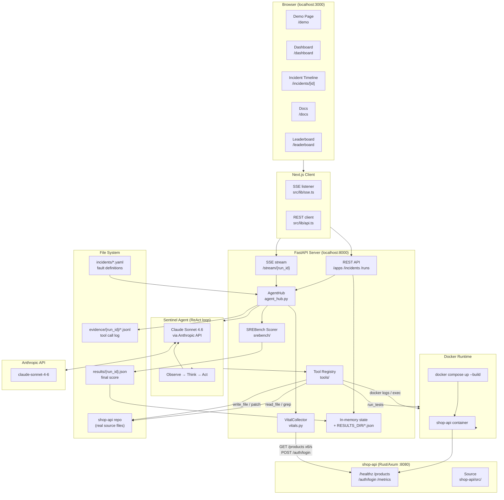

# Sentinel Architecture Diagram



## Key Flows

### Fault Injection + Agent Dispatch
1. User clicks **Deploy Bug** on Demo page
2. `POST /apps/{app}/inject` applies a real git diff to `shop-api/src/`
3. Docker rebuilds the container (app is literally broken)
4. `POST /apps/{app}/runs` dispatches Sentinel: starts a Claude ReAct loop
5. SSE stream pushes live tool calls + agent reasoning to the browser

### Agent ReAct Loop
1. **Observe** - read Docker logs, grep source files, curl endpoints
2. **Think** - Claude reasons about the fault based on evidence
3. **Act** - write a patch, apply it via `git apply`, trigger rebuild
4. **Verify** - run the test suite; if green, mark resolved

### Vitals (Real Data)
- `VitalCollector` fires 6 parallel `GET /products` every second
- Also probes `POST /auth/login` (no password) to detect SRE-0001 panics
- Measurements stored with timestamps; sparklines reflect actual history

### Scoring
```
score = 0.2 * detect + 0.3 * diagnose + 0.5 * fix - time_penalty
solved if score >= 0.70
```
Result written to `results/{run_id}.json` and reloaded on server restart.
```
